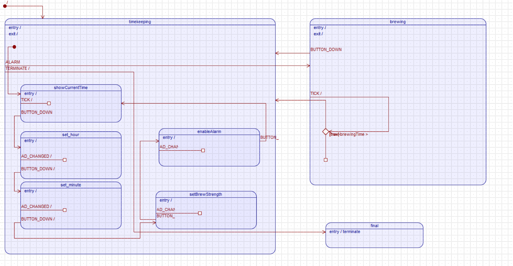

Einleitung
==========

Mit einem Zustandsautomaten lassen sich vielfältigste Aufgaben lösen.
Von einfachen Taschenrechnern bis hin zu komplexen Smartwatches und
intelligenten Routern sind verschiedenste Anwendungen gegeben.

Doch leider wird gerade bei komplexen Projekten in der Praxis häufig die
Größe des benötigten Zustandsautomaten unterschätzt. Gerade während des
gesamten Softwarelebenszyklus ergeben sich durch vielfältige Änderungen
schnell unkontrollierbare Konstrukte, die sich nur mit viel Aufwand
stabilisieren und erweitern lassen. Damit die Wartbarkeit nicht unter
der Komplexität leidet, wurden diverse Pattern als Erweiterung eines
einfachen Zustandsautomaten entwickelt. Hierzu zählt der hierarchische
Zustandsautomat und das Active Object Pattern.

Dabei ist beim Active Object Pattern der "Process" Schritt klar vom
"Dispatch" getrennt. Ein Event wird somit nicht direkt verarbeitet,
sondern in eine Queue abgelegt. Ein Scheduler entscheidet anschließend,
welche Events als nächstes verarbeitet werden sollen. Hierzu nimmt er
eins aus der Queue und ruft den entsprechenden Eventhandler auf.

Durch dieses Vorgehen wird eine "Inversion of Control" erreicht, was die
Verarbeitung von dem Event-Erzeugen gut entkoppelt und die Wartbarkeit
deutlich steigert.

Um diese und weitere Pattern praktisch an einem Beispiel zu erproben,
wird in dieser Arbeit die Umsetzung einer zeitgesteuerten Kaffeemaschine
mittels eines Active Object getriebenen Zustandsautomaten beschrieben.
Hierzu werden im nächsten Kapitel praxisnahe Anforderungen definiert,
die anschließend mit einem MCB2300 Board unter Zuhilfenahme des QP
Frameworks umgesetzt werden. Diese Umsetzung wird im folgenden Kapitel
beschrieben und an Beispielen verdeutlicht. Das anschließende Kapitel
gibt dann ein kurzes Fazit zur Umsetzung und bewertet die gewonnenen
Erkenntnisse.

Im letzten Kapitel fließt noch ein getrenntes Feedback der Autoren ein,
dass die individuelle Umsetzung veranschaulicht.

Anforderungen
=============

Das Ziel der Umsetzung ist eine benutzerfreundliche Kaffeemaschine,
welche auf dem MCB2300 realisiert werden soll. Damit der Nutzer seinen
Kaffee immer zum gewünschten Zeitpunkt erhält, soll eine Zeitsteuerung
für den Brühvorgang umgesetzt werden. Dadurch kann er z. B. am Vortag
die Kaffeemaschine so einstellen, dass am nächsten Morgen, direkt nach
dem Aufstehen, der Kaffee schon bereitsteht. Um dies zu erreichen ist
ein Menü zum Einstellen der Alarmzeit einzubauen, bei dem sich sowohl
Stunden als auch Minuten des geplanten Brühvorganges einstellen lassen.

Damit die Kaffeemaschine, z. B. während eines Urlaubs, keinen Kaffee zu
unerwünschten Tagen zubereitet, soll sich die Zeitsteuerung (Alarm) auch
deaktivieren lassen. Hierzu ist im Menü eine entsprechende Einstellung
vorzusehen. Auch soll der Brühvorgang dann nicht stattfinden, wenn keine
Kaffeekanne bereitsteht. So wird ein Schaden beim Nutzer vermieden, der
durch einen unkontrollierten Brühvorgang entstehen würde.

Des Weiteren soll sich die Kaffeestärke vom Nutzer einstellen lassen,
damit er den Kaffee so erhält, wie er ihn bevorzugt trinkt. Dazu ist im
Menü eine Einstellung für die Kaffeestärke einzurichten, welche
zusätzlich die aktuell eingestellte Stärke auch durch separate Leuchten
dauerhaft und unabhängig von der momentanen Anzeige darstellt.

Aus diesen Anforderungen können folgende User Stories abgeleitet werden,
die die benötigte Funktionalität noch einmal kurz zusammenfasst.

User Stories
------------

-   Als Kaffeetrinker möchte ich die momentane Uhrzeit auf dem Display
    sehen, um festzustellen, wann der nächste Kaffee gebraut wird.

-   Als Kaffeetrinker möchte ich die Startzeit für den Brühvorgang
    einstellen, um erst so spät wie möglich aufstehen zu müssen.

-   Als Kaffeetrinker möchte ich die Stärke zwischen leicht, mittel und
    stark einstellen, um den Kaffee an meine Vorlieben anzupassen.

-   Als Kaffeetrinker möchte ich den automatischen Brühvorgang ein- bzw.
    ausstellen können, damit bei meiner Abwesenheit kein Kaffee
    gebrüht wird.

-   Als Kaffeetrinker möchte ich, dass der Kaffee nicht ausgegeben wird,
    wenn kein Behälter unter der Ausgabe ist, um Sauereien zu vermeiden.

Technische Anforderungen
------------------------

Zusätzlich zu den zuvor genannten funktionalen Anforderungen gibt es
auch technische Anforderungen, welche die zur Verfügung stehende
Hardware beschreiben. Mit ihnen wird die Umsetzung der funktionalen
Anforderungen anhand der gegebenen Eingabe- und Ausgabemittel
beschrieben.

Für die Bedienung der Kaffeemaschine steht ein Knopf (INT0) und ein
Potentiometer zur Verfügung. Hierüber soll das Menü gesteuert werden. Da
keine Kaffeekanne und eine entsprechende Platzierungserkennung zur
Verfügung steht, soll zusätzlich während des Brühvorgangs diese mittels
des Knopfes simuliert werden.

Um die Einstellungen und den aktuellen Status anzuzeigen, stehen ein LCD
sowie eine Reihe LEDs zur Verfügung. Dabei soll vorrangig das LCD
verwendet werden, da die LEDs der Anzeige der Kaffeestärke vorbehalten
sind.

Im Folgenden wird die genaue Benutzung der Hardware beschrieben:

Clock
:   Integration der (Real Time Clock) mit gegebenem Treiber. Die Zeit
    soll nach ISO auf dem LCD angezeigt werden: `23:34:30`

Control Menu

:   Über den INT0 Knopf wird ein Menü durchlaufen. Das Drücken des
    Knopfes wird als Bestätigung interpretiert. Das Menü wird
    sequentiell durchlaufen.

    1.  Startzeit für Brühvorgang
    2.  Kaffeestärke
    3.  Alarm An/Aus

Einstellen der Alarmzeit
:   Die Werte werden von links nach rechts (Stunden, Minuten) mit dem
    Potentiometer eingestellt. Mit INT0 wird eine Zahl bestätigt und zur
    nächsten gewechselt. Nach einem vollständigen Durchlauf wird die
    Zeit gespeichert.

Einstellen der Kaffeestärke
:   Mit dem Potentiometer wird zwischen leicht, mittel und
    stark gewechselt. Die LEDs zeigen die Stärke an. Zwei für leicht,
    vier für mittel und sechs für stark.

Einstellen des Alarms
:   Mit dem Potentiometer wird zwischen Ein und Aus gewechselt. Mit INT0
    wird die Aktion bestätigt.

Simulation Kaffeekanne
:   Brüht die Maschine gerade Kaffee und wird der INT0 Knopf gedrückt,
    ist das gleichwertig zu dem Entfernen der Kanne.

Umsetzung
=========

Mit den zuvor definierten Anforderungen konnte die Umsetzung beginnen.
Hierzu musste das Projekt nicht von Grund auf neu erstellt werden. Als
Basis diente ein vorhandenes Projekt zur Umsetzung einer Alarmuhr. Da
die zeitgesteuerte Kaffeemaschine, wie die Alarmuhr, zu einem gewissen
Zeitpunkt eine Aktion durchführen soll, war dieses Projekt eine sehr
gute Vorlage.

Da bei der Alarmuhr lediglich das Keil Projekt vorhanden war, galt es
zunächst den eingebauten Zustandsautomaten zu analysieren und mittels QM
(QP Modeler) nachzubauen.

Bei der Analyse der Alarmuhr ist aufgefallen, dass diese das orthogonale
Regionen Pattern zur Modellierung verwendet.

Nach dem Umbau galt es das bestehende QM-Modell mit der Alarmuhr auf das
Projekt Kaffeemaschine anzupassen und entsprechend zu erweitern. Die
Erweiterungen waren hierbei das komplette Einstellungs-Menü mit
Abspeichern der Input-Daten, die Verwendung der Real Time Clock (RTC),
das Kaffee brühen an sich, sowie die Simulation der Kaffeekanne. Der
Alarm musste entsprechend auf die neue Prüfbedingung und das
auszulösende Event angepasst werden.

Orthogonale Region
------------------

Mit orthogonalen Region lassen sich Zustandsautomaten bauen, die
unabhängige Teilbereiche aufweisen. Dies bedeutet, dass sich ein System
gleichzeitig in mehreren Zuständen befinden kann. So wird vermieden,
dass die benötigten Zustände durch Kombination explodieren und
unübersichtlich werden.

In Bezug auf die Alarmuhr hat sich dies in einer Trennung der
Alarmeinstellung und -überwachung geäußert. Dadurch konnte gleichzeitig
die Alarmzeit eingestellt bzw. die aktuelle Uhrzeit angezeigt und der
Alarm kontrolliert ausgelöst werden.

UML Modellierung
----------------

Im folgenden Modell ist der hauptsächliche Teilbereich des
Zustandsautomaten mit dem Active Object Pattern mit dessen initial
Status `timekeeping` dargestellt. Darin ist die Anzeige der aktuellen
Uhrzeit, sowie das Einstellungs-Menü mit den einzelnen Status
eingebettet. Initial wird in den Status `showCurrentTime` gewechselt. In
diesem Status wird mit jedem TICK-Signal die aktuelle RTC ausgelesen und
angezeigt. Nach Drücken des Knopfes wird in das Menü und den ersten
Status `set_hour` gewechselt. Nach Einstellen der Alarm-Stunden durch
das Potentiometer und bestätigen mit einem Knopf-Druck kommt man in den
Status `set_minute`, in dem analog verfahren wird. In `setBrewStrength`
kann nun die Stärke des Kaffees mit dem Potentiometer eingestellt
werden. Nach Bestätigen gelangt man in den letzten
Einstellungs-Menü-Status `enableAlarm`. Dabei wird der Alarm aktiviert
oder deaktiviert. Mit einer erneuten Bestätigung wird wieder in den
`showCurrentTime`-Status gewechselt.

In den brewing-Status wird nach Auslösen des Alarms gewechselt. Der
Trigger hierfür kommt vom anderen Teilbereich des Zustandsautomaten, auf
den im anderen Modell noch genauer eingegangen wird. Nach Beenden des
Brühens wird wieder zurück in den timekeeping-Status gewechselt. Wenn
während des Brühens der Knopf gedrückt wird, was der Entnahme der
Kaffeekanne entsprechen soll, wird das Brühen sofort gestoppt und
ebenfalls in den timekeeping-Status zurückgekehrt.

 

Nachfolgend wird der andere Teilbereich des Zustandsautomaten gezeigt,
welcher die Alarmüberwachung enthält. Dieser Teil wurde mit einer
hierarchischen Statemachine umgesetzt. Wenn der Alarm aktiviert ist,
befindet man sich im on-Status. Darin wird mit jedem TICK-Signal die RTC
und die Alarmzeit verglichen und bei Übereinstimmung das ALARM-Signal
getriggert.

 

Verwendete Treiber
------------------

Für die aktuelle Uhrzeit wurde eine auf dem Chip integrierte Real Time
Clock (RTC) verwendet. Für das Auslesen der Uhrzeit wurde das
bereitgestellte Board Support Package (BSP) genutzt. Ebenso wie für das
initiale Setzen der Default-Uhrzeit. Dadurch musste kein zweiter Timer
implementiert werden, welcher sonst für das Hochzählen der Uhrzeit
zuständig gewesen wäre. Der Treiber beinhaltet einen eigenen
Interrupt-Handler.

Um in das Einstellungs-Menü zu gelangen und die einzelnen eingestellten
Werte zu bestätigen wurde der INT0-Knopf genutzt. Dieser wurde ebenfalls
mit dem bereitgestellten Treiber bzw. BSP eingebunden. Dabei wird im
Interrupt-Handler lediglich auf ein ButtonDown reagiert, was dem Drücken
des Knopfes entspricht. Der Treiber beistzt ebenso einen eigenen
Interrupt-Handler.

Alle Werte sind über das Potentiometer bzw. den dazugehörigen
Analog-Digital-Converter einzustellen. Auch hierfür wurde der
bereitgestellte Treiber/BSP verwendet. Dabei gilt zu beachten, dass vor
der Verwendung des AD-Converters, dieser erst noch extra aktiviert
werden muss. Auch dieser Treiber hat einen eigenen Interrupt-Handler.

Zur Visualisierung der aktuellen Uhrzeit, den Menü-Einträgen und den
einzustellenden Werten wurde das LCD mit gegebenem Treiber/BSP benutzt.

Für die Darstellung der Kaffeestärke werden, je nach Wert, einzelne LEDs
an- bzw. ausgeschaltet. Auch hierfür wurde der bereitgestellte Treiber
des BSP genutzt.

Anpassungen am Board Support Package
------------------------------------

Im BSP wurde der Software Layer zur Anbindung an die Hardware umgesetzt.
Dies umfasst:

-   ADC
-   Button
-   LCD
-   RTC
-   LEDs
-   Timer

Es waren keine speziellen größeren Anpassungen nötig, da alle BSPs nach
dem Einbinden und minimalen Anpassungen funktionierten und den
Anforderungen entsprachen. Auch eine separate Entkopplung des Knopfes
entfiel, da eine einfache bereits enthalten war.

Die einzigen Anpassungen waren das Triggern des jeweiligen passenden
Events. Zusätzlich mussten in den Interrupt-Handlern das Sperren der
Interrupts durch QF\_INT\_UNLOCK erweitert werden.

### Handler für den Timer Interrupt

Im Timer1 Interrupt wird direkt auch gleich die A/D Umwandlung
aktiviert.

``` {.c}
__irq void T1_IRQHandler(void)
{
    ...
    QF_INT_UNLOCK();
    QF_tick();
    QF_INT_LOCK();
    ...
    /* ACK Timer1 int */
    AD0CR |= 0x01000000; /* Start A/D Conversion               */
    T1IR = 1; /* Clear interrupt flag               */
    VICVectAddr = 0; /* Acknowledge Interrupt              */
}
```

### Handler für den ADC (nach lesen) Interrupt

Das AD Event wird vom Interrupt-Handler in das Active Object dispatcht.

``` {.c}
__irq void ADC_IRQHandler(void)
{
    short AD_next = (AD0DR0 >> 6) & 0x3FF; /* Read Conversion Result */
    if (AD_last != AD_next)
    {
        AD_last = AD_next;
        adc_change();
    }
    VICVectAddr = 0; /* Acknowledge Interrupt */
}

void adc_change()
{
    ...
    QF_INT_UNLOCK();
    //QActive_postFIFO(ao2, (QEvent *)&event);
    QACTIVE_POST(ao2,
                (QEvent *)&event, (void *)0);
    QF_INT_LOCK();

}
```

Capture - Dispatch - Process
------------------
Wichtig bei diesem Projekt war Einhaltung der Trennung zwischen dem 
Einfangen von Events (Capture), dem Wechsel zwischen den Zuständen 
(Dispatch) und der Ausführung des eigentlichen Prozessteils (Process). 
Eine Zentrale Rolle spielte hierbei auch das Inversion of Control nach 
dem Hollywood-Motto "Don't call us, we call you" sodass das Event Capture, 
Event Dispatch und Event Process voneinander entkoppelt ist.

Das Capture ist in den einzelne Treibern enthalten. Hierbei wird intern, 
sobald ein Interrupt ausgelöst wurde, der jeweilige Interrupt-Handler 
aufgerufen. In diesem wird dann das jeweilige QM Event mit dem dazugehörigen 
Signal erzeugt und in die EventQueue eingefügt.

Das Abarbeiten der EventQueue ist Teil des Dispatch. Dabei wird ein Event 
aus der Queue genommen und bei einem neuen Zustand in diesen gewechselt. 
Bei diesem Wechsel wird ebenfalls die entsprechende auszuführende Methode 
des Programmes aufgerufen.

Beim Process wird nun die vom Dispatch aufgerufene Methode ausgeführt, was 
der eigentlichen Programm-Logik entspricht.


Menü
----

Das Menü auf dem LCD Display kann sequentiell durchlaufen werden. Dabei
sieht die Ausgabe wie folgt aus:

1.  Aktuelle Uhrzeit

        ================
        14:50:00
        ================

2.  Einstellen Alarmzeit (Stunde) mit dem Rad

        ================
        ##:50:00
        ================

3.  Alarmzeit (Minute)

        ================
        14:##:00
        ================

4.  Stärke

        ================
        Set Strength
        ================
        [*] [*] [*] [ ] [ ] [ ]

5.  Alarm An/aus

        ================
        Alarm On
        ================

Resümee Umsetzung
=================

Stolpersteine
-------------

Wir konnten die Aufgaben sehr gut im Team lösen. Teilweise gab es aber
kleine Hindernisse, die unseren Fortschritt verzögert haben.

Compile-Fehler in Keil waren manchmal schwer zu verstehen. Die richtige
Strukturierung der einzelnen Dateien war ebenfalls schwierig.

QM ist gut dokumentiert und hat viele Beispiele. Trotzdem war es schwer
die richtigen Framework-Funktionen zu finden und sie auch im richtigen
Kontext zu verwenden. Die Arbeit mit zwei Tools an der gleichen
Code-Basis war umständlich.

Durch die vier Interrupt-Handler bestehend aus dem des Timers, der RTC,
des Knopfes und des Potentiometers gestaltete es sich relativ schwierig
das System zu debuggen. Es war schlicht fast nicht möglich gewesen, eine
Stelle näher zu analysieren, ohne dass das Programm nach kurzer Zeit
abgebrochen hat. Ebenso nahezu unmöglich gestaltete sich das Debuggen
eines Interrupt-Handlers selbst, da sich das Board dann anders verhalten
und sich zum Beispiel aufgehängt hat.

 

Bewertung der Erkenntnisse
--------------------------

Wir haben gesehen, dass man mit Zustandsautomaten vielfältige Aufgaben
auf unterschiedliche Weisen lösen kann. Dabei kann die Größe des
Zustandsautomaten schnell unübersichtlich und komplex werden, sodass es
Sinn ergab, diese auf mehrere Zustandsautomaten aufzuteilen. So, wie
eben in unserem Fall, mit dem hierarchische Zustandsautomat und das
Active Object Pattern. Allerdings wird es auch wieder schwieriger das
ganze System zu debuggen, da es komplexer wird.

Durch die Verwendung von mehreren Interrupt-Handlern und den dadurch 
auftretenden Probleme, konnte weitere Erfahrungen in der embedded 
Programmierung gewonnen werden. Besonders natürlich auch hier im Hinblick 
auf das Debuggen.

Tools, wie der QP Modeler, helfen hierbei die Automaten grafisch 
übersichtlich darzustellen. Des Weiteren lässt sich das Modell
hervorragend für die Dokumentation des jeweiligen Projektes verwenden.
Ein Nachteil ist aber definitiv, dass eben mit mehreren Programmen an
derselben Code-Basis gearbeitet wird, was zu Problemen führt oder
einfach teilweise nur umständlich ist.

Bei diesem Projekt konnten wir die neuen Erkenntnisse mit State Machines
optimal einsetzen und verinnerlichen. Die Schlüsselkomponenten für ein 
erfolgreiches Eventmanagement (Capture, Dispatch, Process) mit der 
Inversion of Control wurde eingehalten. Auch die objektorientierte 
Programmierung mit Polymorphie, Vererbung, Kapselung wurde aktiv genutzt.

Wir haben das Tool Keil für die embedded Programmierung kennen gelernt. 
Ebenso wie das Quantum Framwork mit dem QP Modeler zur Modelierung der 
Kaffeemaschine und der Generierung der Code-Teile der State Machine. 

Auch die 

\pagebreak

Persönliche Berichte
====================

René Zarwel
-----------

Die Umsetzung der Kaffeemaschine erfolgte vollständig in Zusammenarbeit
an einem Rechner, sodass sich keine getrennten Aufgaben ergeben haben.
Dies hatte den Vorteil, dass das Wissen gleichmäßig verteilt und
Probleme schneller gefunden und gelöst wurden.

Da bei der Umsetzung der Kaffeemaschine immer in beiden Programmen Teile
angepasst werden mussten, wäre eine Aufteilung schlicht und einfach auch
nicht sinnvoll gewesen, da sich jede Änderung des QM-Modell's auch
essentiell auf den Code auswirkt.

\pagebreak

Peter Müller
------------

Ich habe immer versucht das Team möglichst gut zu unterstützen. Da wir
immer zu dritt gemeinsam gearbeitet haben, habe ich bei Gelegenheit
Aufgaben alleine parallel erledigt.

Ich habe die Keil Konfiguration durchgeführt. Auch die zusätzlichen
Einstellungen für den jLink. Ich habe teilweise selbst an den
vorgegebenen Projekten programmiert und ansonsten im Pair Programming
die anderen Teammitglieder begleitet und mitgedacht. Ich habe mir
überlegt wie man die Kaffeemaschine in UML modelliert und Recherche zu
analogen Beispielen von QM durchgeführt. Einige Zustände sowie Übergänge
aus dem QM Modell stammen von mir. Ich habe die Anforderungen an die
Maschine aufgenommen und niedergeschrieben. Den Fortschritt der Software
habe ich mit einer Liste von Aufgaben überwacht und versucht dringende
Aufgaben zu identifizieren.

Ich habe am Board unsere Software getestet und aktiv die Fehlersuche
unterstützt.

\pagebreak

Andreas Wilhelm
---------------

In der Design-Phase bzw bei der Modellierung im QP Modeler war ich zusammen 
mit den anderen beiden aktiv an der Erstellung des Modells beteiligt.

Da ich bereits einiges an Erfahrung in der C und C++ Programmierung mitbringen 
konnte, konnte ich mich sehr gut bei der Implementierung und Umsetzung des 
Projektes einbringen und auch untersützen, wenn es Fragen rund um die C/C++ 
Programmierung gab. Die meiste Zeit haben wir jedoch gemeinsam daran 
entwickelt, da damit auch das Wissen gleichmäßig verteilt wurde und somit 
keine großen Verständnislücken entstehen konnten. Wenn es gerade sinnvoll 
und überhaupt möglich war, konnte einer ab und zu etwas anderes, wie zum 
Beispiel Recherche-Arbeit, nebenher erledigen, sodass die anderen beiden im 
Pair Programming effektiver arbeiten konnten.  Vor allem wenn es an das 
Testen und die Fehlersuche ging, war es ein immenser Vorteil, wenn einfach 
alle mitdenken und das auftretenede Problem dadurch schnell und effektiv 
behoben werden konnnte. Jeder konnte seine Erfahrungen und Ideen 
hervorragend einbringen, sodass es eine sehr gute Teamarbeit mit dem 
Resultat einer funktionierenden CoffeMachine war.

Bei dieser Dokumentation war ich maßgeblich an dem Kapitel der Umsetzung, 
hierbei vor allem 3.2, 3.3 und 3.5 und der Resümee Umsetzung, 
besonders 4.2, beteiligt.

Für mich persönlich war dieses Projekt, ein recht anspruchsvolles Projekt, 
vor allem jedoch, wegen der recht knapp bemessenen Zeit. Dabei habe ich 
jedoch vieles über Zustandsautomaten gelernt und verinnerlich können. Vor 
allem die Umsetzung von komplexeren und verschachtelten State Machines war 
eine sehr interessante Erfahrung, wobei es natürlich verglichen mit den 
Real-World-Projekten, noch sehr klein war. Aber die Konzepte sind klar. 
Besonders bemerkenswert war die Verwendung der objektorientierten 
Programmierung in Verbindung mit den State Machines. Auch die aktive 
Verwendung des QP Model konnte mein Horizont rund um 
Code-Modelierung-Generierungs-Tools erweitern. Wie bei fast jedem 
Embedded-Projekt treten irgendwelche Probleme auf, die es zu lösen 
gilt, was uns im Team meiner Meinung nach sehr gut gelungen ist.
