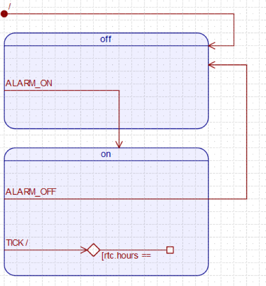

Einleitung
==========

Mit einem Zustandsautomaten lassen sich vielfältigste Aufgaben lösen. Von einfachen
Taschenrechnern bis hin zu komplexen Smartwatches und intelligenten Routern
sind verschiedenste Anwendungen gegeben.

Doch leider wird gerade bei komplexen Projekten in der Praxis häufig die Größe
des benötigten Zustandsautomaten unterschätzt. Gerade während des gesamten
Softwarelebenszyklus ergeben sich durch vielfältige Änderungen schnell
unkontrollierbare Konstrukte, die sich nur mit viel Aufwand stabilisieren und
erweitern lassen. Damit die Wartbarkeit nicht unter der Komplexität leidet,
wurden diverse Pattern als Erweiterung eines einfachen Zustandsautomaten entwickelt.
Hierzu zählt der hierarchische Zustandsautomat und das Active Object Pattern.

Dabei ist beim Active Object Pattern der "Process" Schritt klar vom "Dispatch"
getrennt. Ein Event wird somit nicht direkt verarbeitet, sondern in eine Queue
abgelegt. Ein Scheduler entscheidet anschließend, welche Events als nächstes
verarbeitet werden sollen. Hierzu nimmt er eins aus der Queue und ruft den
entsprechenden Eventhandler auf.

Durch dieses Vorgehen wird eine "Inversion of Control" erreicht, was die
Verarbeitung von dem Event-Erzeugen gut entkoppelt und die Wartbarkeit deutlich
steigert.

Um diese und weitere Pattern praktisch an einem Beispiel zu erproben, wird in
dieser Arbeit die Umsetzung einer zeitgesteuerten Kaffeemaschine mittels eines
Active Object getriebenen Zustandsautomaten beschrieben. Hierzu werden im nächsten
Kapitel praxisnahe Anforderungen definiert, die anschließend mit einem MCB2300
Board unter Zuhilfenahme des QP Frameworks umgesetzt werden. Diese Umsetzung wird
im folgenden Kapitel beschrieben und an Beispielen verdeutlicht. Das anschließende
Kapitel gibt dann eine kurzes Fazit zur Umsetzung und bewertet die gewonnen
Erkenntnisse.

Im letzten Kapitel fließt noch ein getrenntes Feedback der Autoren ein, dass die
individuelle Umsetzung veranschaulicht.

Anforderungen
=============

Das Ziel der Umsetzung ist eine benutzerfreundliche Kaffeemaschine,
welche auf dem MCB2300 realisiert werden soll. Damit der Nutzer seinen Kaffee
immer zum gewünschten Zeitpunkt erhält, soll eine Zeitsteuerung für den
Brühvorgang umgesetzt werden. Dadurch kann er z.B. am Vortag die Kaffeemaschine
so einstellen, dass am nächsten Morgen, direkt nach dem Aufstehen, der Kaffee
schon bereit steht. Um dies zu erreichen ist ein Menü zum Einstellen der
Alarmzeit einzubauen, bei dem sich sowohl Stunden als auch Minuten des geplanten
Brühvorganges einstellen lassen.

Damit die Kaffeemaschine, z.B. während eines Urlaubs, keinen Kaffee
zu unerwünschten Tagen zubereitet,
soll sich die Zeitsteuerung (Alarm) auch deaktivieren lassen. Hierzu ist
im Menü eine entsprechende Einstellung vorzusehen. Auch soll der
Brühvorgang dann nicht stattfinden, wenn keine Kaffeekanne bereit steht. So wird
ein Schaden beim Nutzer vermieden, der durch einen unkontrollierten Brühvorgang
entstehen würde.

Des Weiteren soll sich die Kaffeestärke vom Nutzer einstellen lassen, damit er
den Kaffee so erhält, wie er ihn bevorzugt trinkt. Dazu ist im Menü eine Einstellung
für die Kaffeestärke einzurichten, welche zusätzlich die aktuell eingestellt Stärke
auch durch separate Leuchten dauerhaft und unabhängig von der momentanen
Anzeige darstellt.

Aus diesen Anforderungen können folgende User Stories abgeleitet werden, die die
benötigte Funktionalität noch einmal kurz zusammenfasst.

User Stories
------------

-   Als Kaffeetrinker möchte ich die momentane Uhrzeit auf dem Display
    sehen, um festzustellen, wann der nächste Kaffee gebraut wird.

-   Als Kaffeetrinker möchte ich die Startzeit für den Brühvorgang
    einstellen, um erst so spät wie möglich aufstehen zu müssen.

-   Als Kaffeetrinker möchte ich die Stärke zwischen leicht, mittel und
    stark einstellen, um den Kaffee anzupassen.

-   Als Kaffeetrinker möchte ich den automatischen Brühvorgang ein- bzw.
    ausstellen können, damit bei meiner Abwesenheit kein Kaffee gebrüht wird.

-   Als Kaffeetrinker möchte ich, dass der Kaffee nicht ausgegeben wird,
    wenn kein Behälter unter der Ausgabe ist, um Sauereien zu vermeiden.

Technische Anforderungen
------------------------

Zusätzlich zu den zuvor genannten funktionalen Anforderungen gibt es auch
technische Anforderungen, die die zur Verfügung stehende Hardware beschreiben.
Mit ihnen wird die Umsetzung der funktionalen Anforderungen anhand der gegebenen
Eingabe- und Ausgabemittel beschrieben.

Für die Bedienung der Kaffeemaschine steht ein Knopf (INT0) und ein Potentiometer
zur Verfügung. Hierüber soll das Menü gesteuert werden. Da keine Kaffeekanne und
eine entsprechende Platzierungserkennung zur Verfügung steht, soll zusätzlich
während des Brühvorgangs diese mittels des Knopfes simuliert werden.

Um die Einstellungen und den aktuellen Status anzuzeigen, stehen ein LCD Display
sowie eine reihe LEDs zur Verfügung. Dabei soll vorrangig das LCD Display verwendet
werden, da die LEDs der Anzeige der Kaffeestärke vorbehalten sind.

Im Folgenden wird die genaue Benutzung der Hardware beschrieben:

Clock
:   Integration der  (Real Time Clock) mit gegebenem Treiber. Die Zeit soll nach ISO
    auf dem LCD angezeigt werden: `23:34:30`

Control Menu
:   Über den INT0 Knopf wird ein Menü durchlaufen. Das Drücken des Knopfes
    wird als Bestätigung interpretiert. Das Menü wird
    sequentiell durchlaufen.

    1.  Startzeit für Brühvorgang
    2.  Kaffeestärke
    3.  Alarm An/Aus

Einstellen der Kaffeestärke
:   Mit dem Potentiometer wird zwischen leicht, mittel und stark gewechselt.
    Die LEDs zeigen die Stärke an. Zwei für leicht, vier für mittel und sechs
    für stark.

Einstellen der Alarmzeit
:   Die Werte werden von links nach rechts (Stunden,
    Minuten) mit dem Potentiometer eingestellt. Mit INT0 wird eine Zahl bestätigt und
    zur nächsten gewechselt. Nach einem vollständigen Durchlauf wird die Zeit
    gespeichert.

Simulation Kaffeekanne
:   Brüht die Maschine gerade Kaffee und wird der INTO Knopf gedrückt,
    ist das gleichwertig zu dem Entfernen der Kanne.

Umsetzung
=============

Mit den zuvor definierten Anforderungen konnte die Umsetzung beginnen. Hierzu
musste das Projekt nicht von Grund auf neu erstellt werden. Als Basis diente
ein vorhandenes Projekt zur Umsetzung einer Alarmuhr. Da die zeitgesteuerte
Kaffeemaschine, wie die Alarmuhr, zu einem gewissen Zeitpunkt eine Aktion
durchführt soll, war dieses Projekt eine sehr gute Vorlage.

Da bei der Alarmuhr lediglich das Keil Projekt vorhanden war, galt es zunächst
den eingebauten Zustandsautomaten zu analysieren und mittels QM (QP Modeler)
nachzubauen.

Bei der Analyse der Alarmuhr ist aufgefallen, dass diese das orthogonale Regionen
Pattern zur Modellierung verwendet.

Orthogonale Region
------------------------  
Mit orthogonalen Region lassen sich Zustandsautomaten bauen, die unabhängige
Teilbereiche aufweisen. Dies bedeutet, dass sich ein System gleichzeitig in
mehreren Zuständen befinden kann. So wird vermieden, dass die benötigten
Zustände durch Kombination explodieren und unübersichtlich werden.

In Bezug auf die Alarmuhr hat sich dies in einer Trennung der Alarmeinstellung und
-überwachung geäußert. Dadurch konnte gleichzeitig die Alarmzeit eingestellt bzw.
die aktuelle Uhrzeit angezeigt und der Alarm kontrolliert ausgelöst werden.  

UML Modellierung
------------------------

Verwendete Treiber
------------------------

Anpassungen am Board Support Package
------------------------

Resümee Umsetzung
=============

\pagebreak

Persönliche Berichte
=============

René Zarwel
------------------------
Die Umsetzung der Kaffeemaschine erfolgte vollständig in Zusammenarbeit an einem
Rechner, sodass sich keine getrennten Aufgaben ergeben haben. Dies hatte den Vorteil,
dass das Wissen gleichmäßig verteilt und Probleme schneller gefunden wurden.

\pagebreak

Peter Müller
------------------------

\pagebreak

Andreas Wilhelm
------------------------
